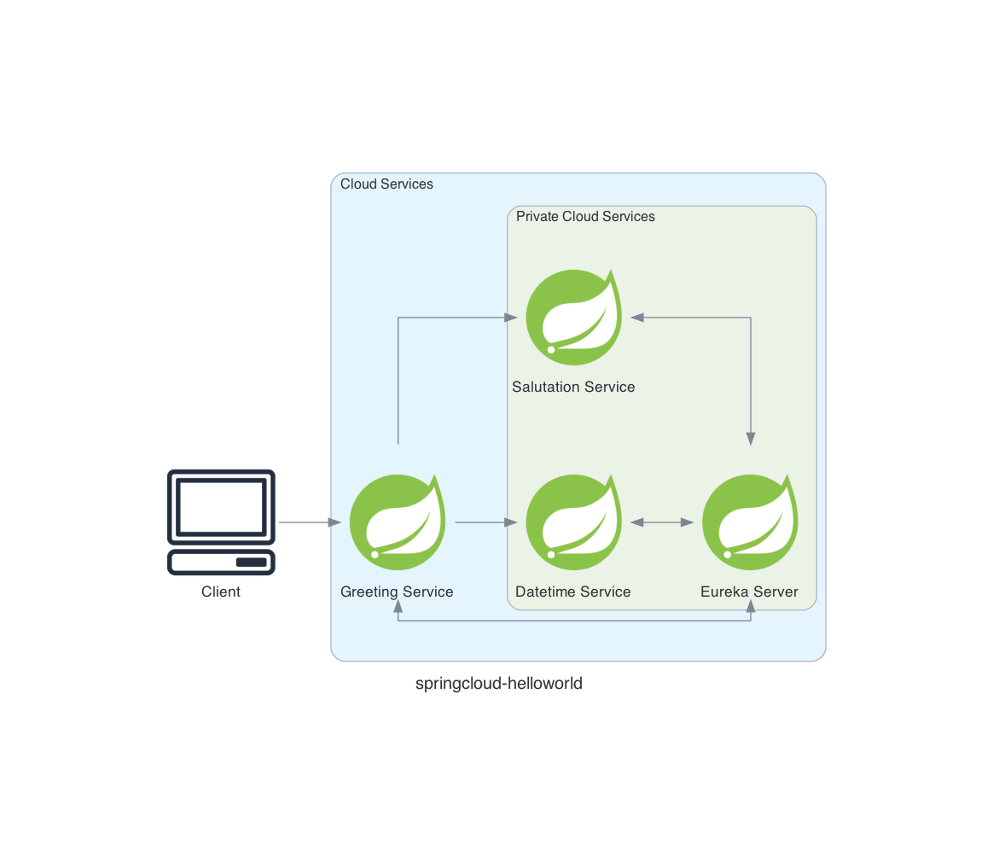

# SpringCloud HelloWorld
This is a helloworld style project for SpringCloud. It is heavily inspired by JavaBrains.io Youtube tutorial.

It contains 3 microservices:
* datetime-service: returns the current datetime
* salutation-service: returns at random a salutation for male or female persons
* greeting-service: uses the first 2 services to compose a greeting

Here's a diagram how they all interact with each other:


## Keypoints
* each microservice should be standalone. As a consequence, there is some code duplication in the model package. 
  
  A common dependency on the datamodel breaks the standalone principle.
* Each REST endpoint returns an object. This makes it easy to change the return values. 
 
   Suppose an endpoint returns a String. After some time, you need to return a List as well. Now the response of the endpoint breaks the consuming clients.  If an object is returned, you can add a field without breaking anything, because spring only unserializes the field it's aware of.
* Configure the server port explicitly. This avoids port collision :smiley:

* From the level 2 series: keep in mind hystrix wraps the class containing the ``@HystrixCommand`` annotation in a **PROXY CLASS** - I've put it in bold as this is very important.
  * if the fallbackMethod is a method in the same class it will not work, [because of the proxy class](https://youtu.be/1EIb-4ipWFk?list=PLqq-6Pq4lTTbXZY_elyGv7IkKrfkSrX5e&t=517)!
  * My solution:
    1. The service class containing the method that can go awry, also contains the fallback method. No ``@HystrixCommand`` involved here
    1. The ``RestController`` class has the service autowired. To be precise: the service wrapped in **the proxy class**. The endpoint calling the awry service method **is** annotated with the``@HystrixCommand`` annotation
    1. The fallbackMethod defined in the ``RestController`` class just delegates to the fallback method of the autowired service. This is not an issue, as the fallback method is also wrapped in the proxy class
    
    

## Spinning up multiple instances
Kick of the jar and set the ``spring.port`` property with the ``java``  command. However it's quite tedious if you want 4 instances of each of the three microservices. Below an powershell snippet on how to kick things off quickly. It generates the commands that you then can paste in the bash terminal

```powershell
$template = 'java -Dserver.port={0} -jar {1} &'
#get jars except eureka-server
$startPort=50000
$increment = 100
gci -Recurse *.jar |?{$_.name -notlike '*eureka*'} |%{
 $jarName = $_
 0..3 | %{$port = $startPort +$_; $template -f $port,$jarName}
 $startPort+=$increment
}
```

Sample output:
```
java -Dserver.port=50000 -jar /Users/pjd/_dev/springcloud-helloworld/datetime-service/target/datetime-service-0.0.1-SNAPSHOT.jar &
java -Dserver.port=50001 -jar /Users/pjd/_dev/springcloud-helloworld/datetime-service/target/datetime-service-0.0.1-SNAPSHOT.jar &
java -Dserver.port=50002 -jar /Users/pjd/_dev/springcloud-helloworld/datetime-service/target/datetime-service-0.0.1-SNAPSHOT.jar &
java -Dserver.port=50003 -jar /Users/pjd/_dev/springcloud-helloworld/datetime-service/target/datetime-service-0.0.1-SNAPSHOT.jar &

java -Dserver.port=50100 -jar /Users/pjd/_dev/springcloud-helloworld/greeting-service/target/greeting-service-0.0.1-SNAPSHOT.jar &
java -Dserver.port=50101 -jar /Users/pjd/_dev/springcloud-helloworld/greeting-service/target/greeting-service-0.0.1-SNAPSHOT.jar &
java -Dserver.port=50102 -jar /Users/pjd/_dev/springcloud-helloworld/greeting-service/target/greeting-service-0.0.1-SNAPSHOT.jar &
java -Dserver.port=50103 -jar /Users/pjd/_dev/springcloud-helloworld/greeting-service/target/greeting-service-0.0.1-SNAPSHOT.jar &

java -Dserver.port=50200 -jar /Users/pjd/_dev/springcloud-helloworld/salutation-service/target/salutation-service-0.0.1-SNAPSHOT.jar &
java -Dserver.port=50201 -jar /Users/pjd/_dev/springcloud-helloworld/salutation-service/target/salutation-service-0.0.1-SNAPSHOT.jar &
java -Dserver.port=50202 -jar /Users/pjd/_dev/springcloud-helloworld/salutation-service/target/salutation-service-0.0.1-SNAPSHOT.jar &
java -Dserver.port=50203 -jar /Users/pjd/_dev/springcloud-helloworld/salutation-service/target/salutation-service-0.0.1-SNAPSHOT.jar &
```
